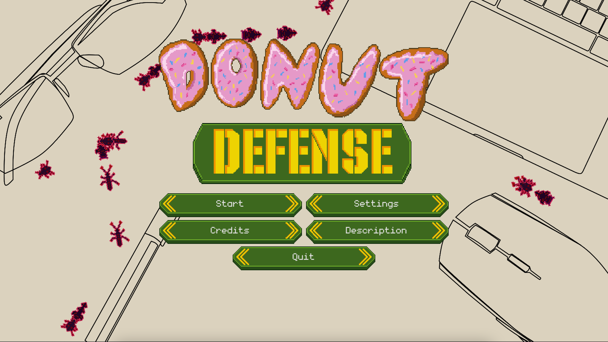

# Donut Defense #

A simple tower defense game made for [Go Godot 2 Jam](https://itch.io/jam/go-godot-jam-2). Download or play on [itch](https://dmitriy-shmilo.itch.io/donut-defense).

    
    
    
    

# Credits #

## Font ##
- [monogram](https://datagoblin.itch.io/monogram) by datagoblin

## SFX ##
- [up-down-thing-1](https://freesound.org/people/Timbre/sounds/138002/) by Timbre
- [Tonal beep patch_1](https://freesound.org/people/newlocknew/sounds/563915/) by newlocknew
- [M4 Assault rifle firing](https://freesound.org/people/mnslugger20/sounds/259758/) by mnslugger20
- [30-30 Lever Rifle Gunshot 2](https://freesound.org/people/Erokia/sounds/410400/) by Erokia

## Music ##
- [Tragic ambient main menu](https://opengameart.org/content/tragic-ambient-main-menu) by brandon75689
- [Dream Raid](https://opengameart.org/content/dream-raid-cinematic-action-soundtrack) by [Matthew Pablo](http://www.matthewpablo.com/)
- [Wasteland Overdrive](https://opengameart.org/content/wasteland-overdrive) by [Matthew Pablo](http://www.matthewpablo.com/)
- [Imminent Threat](https://opengameart.org/content/imminent-threat) by [Matthew Pablo](http://www.matthewpablo.com/)
- [The Fall of Arcana](https://opengameart.org/content/the-fall-of-arcana-epic-game-theme-music) by [Matthew Pablo](http://www.matthewpablo.com/)

## Art ##
- [Dmitriy Shmilo](https://github.com/dmitriy-shmilo)
- [Irene Bagachuk](https://www.artstation.com/i_bahachuk)
